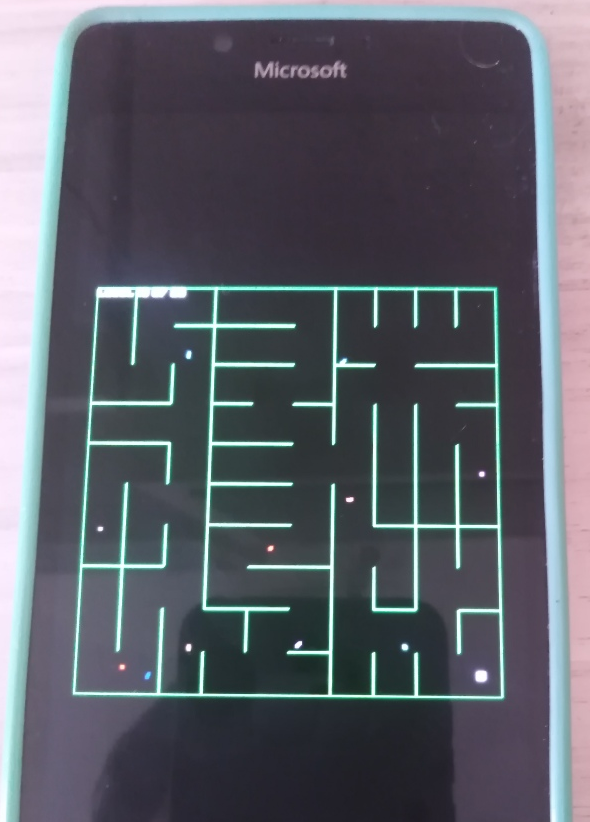
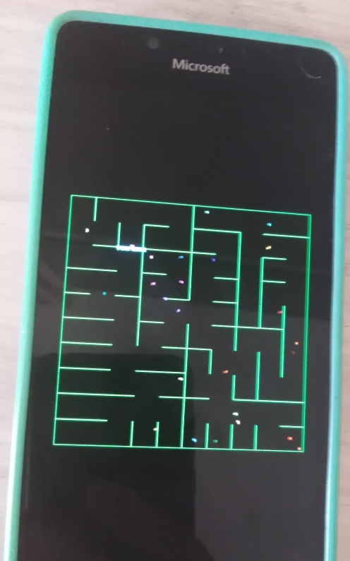

# TiltMaze 1.1 -- main branch

## Preface
Back in 1991, when I was a 1st-year university student, I made this toy in the Pascal language in the Borland environment. Then, of course, I lost its source codes. And so, a lot of years later, in the viber coding mode, I recreated that little thing. I remember that the students from my group liked her then. In general, I'm sharing an option for the good old Microsoft Lumia winphones! =)))))))))))))

## Game scenario & Notes
- User wants player (red ball) movement fixed for keyboard (arrows) when no gyroscope is present.
- Enemy count equals current level number; enemies should move diagonally, bounce off maze walls, and appear as small squares of random color.
- On enemy collision, player returns to start of current level.
- Player must complete 50 maze levels.
- Existing code for player and enemy movement and drawing has been reviewed.
- Exit must be drawn as a small gray unfilled square (20x20) in the center of the bottom-right cell.
- Level completion should occur when player reaches the exit, not by coordinates.
- On winning (after level 50), display "You Win!" and halt the game (do not exit).
- Game area should scale to fit device screen size (scaling for retro smartphones like Lumia).
- Add sound effects: wall bounce (enemy), and player-enemy collision.
- After scaling, player start position is no longer centered in the top-left cell; needs fixing.
- Add looping background music (game_level_music.wav) at the start of each level.
- Add touch swipe controls for player movement on touch devices.

## Screenshots

## Tech details
- UWP app (micro-game)
- Min. Win. SDK used: 10240 (Astoria compatibility)
- Monogame "engine" used
- Windsurf's ChatGPT 4.1 AI used for simple gamedev routines

## Task List
- [x] Review project structure and relevant files (Game1.cs, Enemy.cs)
- [x] Analyze current player movement implementation
- [x] Analyze current enemy movement implementation
- [x] Fix player movement to ensure correct arrow key control
- [x] Update enemy appearance to be small squares of random color
- [x] Ensure enemies move diagonally and bounce off walls as described
- [x] Implement correct collision logic (player returns to start on enemy collision)
- [x] Test and polish movement and collision behaviors
- [x] Draw exit in bottom-right cell (20x20 gray unfilled square)
- [x] Update level completion logic: finish level when player reaches exit
- [x] Display "You Win!" message and halt game on victory
- [x] Implement game area scaling for different screen sizes
- [x] Add sound effect for enemy wall bounce
- [x] Add sound effect for player-enemy collision
- [x] Fix player start position centering after scaling
- [x] Add looping background music for each level
- [x] Add touch swipe controls for player movement

## TODO / Current Goal
- Fix accelerometer / gyroscope
- Polish and test final gameplay experience (add some coins, score, lives, wall breaks, etc... )
## Reference
- https://mixkit.co/free-sound-effects/game/ Free game sound effects

## ..
As is. No support. Just for fun! DIY.

## .
[m][e] 2020 -- 2025