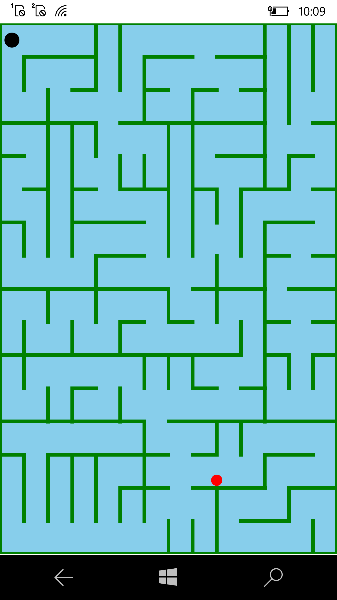

# TiltMazePuzzle

TiltMazePuzzle is a Xamarin.Forms application that demonstrates various features of 2D graphics. It runs on Universal Windows Platform devices 
(and may be simply extended to iOS, Android).

