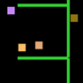
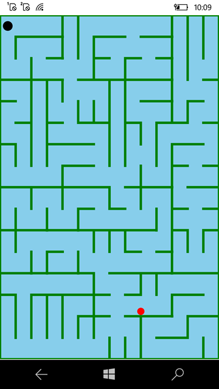

# TiltMazePuzzle v1.0.1

TiltMazePuzzle is a Xamarin.Forms application that demonstrates various features of 2D graphics. It runs on Universal Windows Platform devices 
(and may be simply extended to iOS, Android).

## Description

TiltMazePuzzle is a Xamarin.Forms application that demonstrates various features of 2D graphics. 
It runs on Win 10 Mobile, and Win 10 Desktop (because UWP app). Random enemy generation/addition planned :)

## App type
- sample game app
- language: csharp
- framework: xamarin forms
- features: gyroscope support; random labirynth generation

## Status
Experimenting with kbd control (I added it via AI... but no results yet!)

## Screenshot

## ..
As is. No support. RnD only. DIY.

## .
[m][e] 2020-2025

